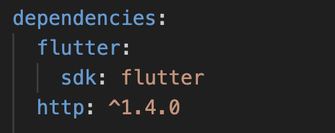

# Integrasi REST API Di Flutter

Jum'at, 16 Mei 2025.

Dokumentasi proyek Kuliah Tamu Online Pradita University.

Catatan: Dokumentasi di bawah ini tidak membahas kesuluruhan topik di Kuliah Tamu dan hanya membahas tentang tahap-tahap cara integrasi REST API di Flutter.

## Deskripsi

Di proyek ini, kita akan membuat sebuah aplikasi CRUD sederhana untuk mendata user dengan menggunakan Flutter dan Beeceptor sebagai API nya.

## Requirement

Pastikan kalian sudah memiliki pengetahuan dasar mengenai Flutter dan REST API, serta sudah menginstall hal-hal di bawah ini pada device kalian:
- Flutter SDK
- Android Studio/Visual Studio Code
- XCode & Simulator (Mac)

## Implementasi

1. Buat project Flutter baru pada Android Studio/Visual Studio Code

2. Tambahkan dependency `http: ^1.4.0` pada pubspec.yaml


3. Pada folder 'lib' buat 3 buah folder baru bernama `model`, `services`, dan `screens`

4. Pada folder `model` yang sudah dibuat, buat file bernama `user.dart` lalu tambahkan kode di bawah ini:
```
class User {
  final String? id;
  final String name;
  final String email;

  User({this.id, required this.name, required this.email});

  factory User.fromJson(Map<String, dynamic> json) {
    return User(id: json['id'], name: json['name'], email: json['email']);
  }

  Map<String, dynamic> toJson() {
    return {"name": name, "email": email};
  }
}
```
> JANGAN LUPA UNTUK DI SAVE

5. Selanjutnya pada folder `services`, buat file bernama `api_service.dart` dan tambahkan kode ini:
```
import 'dart:convert';
import 'package:http/http.dart' as http;
import '../model/user.dart';

class ApiService {
  final String baseUrl =
      'your-beeceptor-api-key';

  Future<List<User>> fetchUsers() async {
    final response = await http.get(Uri.parse(baseUrl));
    if (response.statusCode == 200) {
      List<dynamic> jsonData = jsonDecode(response.body);
      return jsonData.map((e) => User.fromJson(e)).toList();
    } else {
      throw Exception('Failed to load users');
    }
  }

  Future<void> createUser(User user) async {
    final response = await http.post(
      Uri.parse(baseUrl),
      headers: {'Content-Type': 'application/json'},
      body: jsonEncode(user.toJson()),
    );
    if (response.statusCode != 200 && response.statusCode != 201) {
      throw Exception('Failed to create user');
    }
  }

  Future<void> updateUser(String id, User user) async {
    final response = await http.put(
      Uri.parse('$baseUrl/$id'),
      headers: {'Content-Type': 'application/json'},
      body: jsonEncode(user.toJson()),
    );
    if (response.statusCode != 200) {
      throw Exception('Failed to update user');
    }
  }

  Future<void> deleteUser(String id) async {
    final response = await http.delete(Uri.parse('$baseUrl/$id'));
    if (response.statusCode != 200) {
      throw Exception('Failed to delete user');
    }
  }
}
```
> JANGAN LUPA UNTUK DI SAVE

6. Setelah itu pada folder `screens`, buat satu file bernama `user_screen.dart` dan tambahkan kode ini:
```
import 'package:flutter/material.dart';
import '../model/user.dart';
import '../services/api_service.dart';

class UserScreen extends StatefulWidget {
  @override
  State<UserScreen> createState() => _UserScreenState();
}

class _UserScreenState extends State<UserScreen> {
  final ApiService apiService = ApiService();
  late Future<List<User>> futureUsers;

  @override
  void initState() {
    super.initState();
    futureUsers = apiService.fetchUsers();
  }

  void _refresh() {
    setState(() {
      futureUsers = apiService.fetchUsers();
    });
  }

  void _showForm({User? user}) {
    final nameController = TextEditingController(text: user?.name);
    final emailController = TextEditingController(text: user?.email);

    showDialog(
      context: context,
      builder:
          (_) => AlertDialog(
            title: Text(user == null ? 'Add User' : 'Edit User'),
            content: Column(
              mainAxisSize: MainAxisSize.min,
              children: [
                TextField(
                  controller: nameController,
                  decoration: InputDecoration(labelText: 'Name'),
                ),
                TextField(
                  controller: emailController,
                  decoration: InputDecoration(labelText: 'Email'),
                  keyboardType: TextInputType.emailAddress,
                ),
              ],
            ),
            actions: [
              TextButton(
                onPressed: () => Navigator.of(context).pop(),
                child: Text('Cancel'),
              ),
              TextButton(
                onPressed: () async {
                  final newUser = User(
                    id: user?.id,
                    name: nameController.text,
                    email: emailController.text,
                  );
                  if (user == null) {
                    await apiService.createUser(newUser);
                  } else {
                    await apiService.updateUser(user.id!, newUser);
                  }
                  Navigator.of(context).pop();
                  _refresh();
                },
                child: Text('Save'),
              ),
            ],
          ),
    );
  }

  void _confirmDelete(String id) {
    showDialog(
      context: context,
      builder:
          (_) => AlertDialog(
            title: Text('Delete User'),
            content: Text('Are you sure you want to delete this user?'),
            actions: [
              TextButton(
                onPressed: () => Navigator.of(context).pop(),
                child: Text('Cancel'),
              ),
              TextButton(
                onPressed: () async {
                  await apiService.deleteUser(id);
                  Navigator.of(context).pop();
                  _refresh();
                },
                child: Text('Delete', style: TextStyle(color: Colors.red)),
              ),
            ],
          ),
    );
  }

  @override
  Widget build(BuildContext context) {
    return Scaffold(
      appBar: AppBar(title: Text('User Management')),
      body: FutureBuilder<List<User>>(
        future: futureUsers,
        builder: (context, snapshot) {
          if (snapshot.hasData) {
            final users = snapshot.data!;
            return RefreshIndicator(
              onRefresh: () async => _refresh(),
              child: ListView.builder(
                itemCount: users.length,
                itemBuilder: (_, index) {
                  final user = users[index];
                  return ListTile(
                    title: Text(user.name),
                    subtitle: Text(user.email),
                    trailing: Row(
                      mainAxisSize: MainAxisSize.min,
                      children: [
                        IconButton(
                          icon: Icon(Icons.edit),
                          onPressed: () => _showForm(user: user),
                        ),
                        IconButton(
                          icon: Icon(Icons.delete),
                          onPressed: () => _confirmDelete(user.id!),
                        ),
                      ],
                    ),
                  );
                },
              ),
            );
          } else if (snapshot.hasError) {
            return Center(child: Text('Error: ${snapshot.error}'));
          }
          return Center(child: CircularProgressIndicator());
        },
      ),
      floatingActionButton: FloatingActionButton(
        onPressed: () => _showForm(),
        child: Icon(Icons.add),
      ),
    );
  }
}
```
> JANGAN LUPA UNTUK DI SAVE

7. Terakhir, pada `main.dart` ubah kode-nya menjadi seperti ini:
```
import 'package:flutter/material.dart';
import './screens/user_screen.dart';

void main() => runApp(MyApp());

class MyApp extends StatelessWidget {
  @override
  Widget build(BuildContext context) {
    return MaterialApp(
      title: 'Flutter User CRUD',
      theme: ThemeData(primarySwatch: Colors.blue),
      home: UserScreen(),
    );
  }
}
```
> JANGAN LUPA UNTUK DI SAVE

### Penutup
Setelah melakukan seluruh tahap implementasi di atas, silahkan jalankan proyek pada emulator/device kalian. Uji aplikasi yang kalian buat dan ber-eksperimenlah terhadapnya.

Semoga membantu! :smile:

## Author

Dokumentasi ini dibuat oleh Dhiaulhaq Muhammad Naufal.

Punya pertanyaan? Jangan sungkan untuk hubungi saya!
* X: [@DhiaulhaqDev](https://x.com/dhiaulhaqdev)
* Email: [dmnaufal791@gmail.com](mailto:dmnaufal791@gmail.com)
* Website: [dhiaulhaq.github.io](https:dhiaulhaq.github.io)
* Linkedin: [Dhiaulhaq Muhammad Naufal](https://www.linkedin.com/in/dhiaulhaq-muhammad-naufal-031409158)